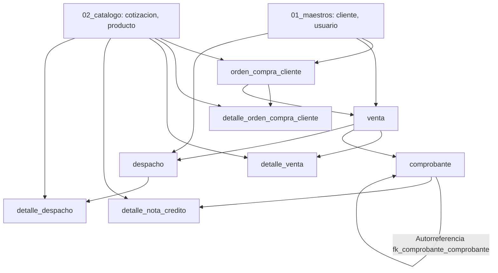

# Documentación de Desarrollo — Bloque 04: Comercial (SIGMETA)

**Estudiante Responsable:** Estudiante 4  
**Proyecto:** SIGMETA (Sistema de Información para GRUPO META)  
**Curso:** Programación 3 — PUCP  
**Archivo SQL:** `sql/04_comercial.sql`

---

## 1. Contexto y Objetivos del Bloque

El bloque **04_comercial.sql** es el núcleo de las operaciones de venta y distribución en SIGMETA. Cubre el ciclo comercial completo:
1. Recepción y registro de la **Orden de Compra del Cliente** (generada a partir de una cotización aceptada o de forma directa).
2. Registro de la **Venta** (al contado o crédito, con control de línea de crédito).
3. Emisión de **Comprobantes Electrónicos** (Facturas, Boletas, Notas de Crédito, Notas de Débito).
4. Generación y control de **Despachos** físicos de mercadería (guías de remisión y avances de entrega).
5. Emisión de **Notas de Crédito** con devolución/ajuste detallado de productos.

---

## 2. Decisiones Clave de Arquitectura y Diseño

### 2.1. Mapeo de Herencia: *Table per Concrete Class*
En Java existen dos superclases abstractas:
- `DocumentoComercial`: Contiene atributos comunes (`numero`, `fechaEmision`, `moneda`, `subTotal`, `igv`, `total`, `observaciones`, `fechaRegistro`, `usuarioRegistro`, `anulado`, `motivoAnulacion`, `fechaAnulacion`).
- `LineaDocumento`: Contiene atributos de líneas de detalle (`numeroLinea`, `producto`, `cantidad`, `precioUnitario`, `descuento`, `importe`).

**Decisión en BD:** No se crean tablas para clases abstractas. Cada tabla hija concreta (`orden_compra_cliente`, `venta`, `detalle_orden_compra_cliente`, `detalle_venta`, `detalle_nota_credito`) copia e implementa estas columnas directamente en su esquema.

---

### 2.2. Modelado de Notas de Crédito y Autorreferencia en `comprobante`
- **¿Por qué la Nota de Crédito no es una tabla separada?**  
  En el modelo de dominio, `Venta` tiene una relación `List<Comprobante>` y un comprobante puede emitirse por diferentes conceptos fiscales (`FACTURA`, `BOLETA`, `NOTA_CREDITO`, `NOTA_DEBITO`). Si se separara la nota de crédito en otra tabla, se rompería la relación de colección y la trazabilidad fiscal unificada.
- **Autorreferencia (`fk_comprobante_comprobante`):**  
  La columna `id_comprobante_relacionado INT NULL` permite que una Nota de Crédito apunte a la Factura/Boleta origen que está corrigiendo o anulando. En facturas y boletas normales, este campo permanece `NULL`.
- **Columna `motivo`:**  
  Se añadió `motivo VARCHAR(200) NULL` en `comprobante` para justificar la emisión de la nota de crédito (ej. defecto de fábrica, devolución comercial).

---

### 2.3. Nueva Entidad y Tabla: `detalle_nota_credito`
- Para saber con exactitud **qué productos y qué cantidades** son devueltos o corregidos en una nota de crédito, se incorporó la entidad `DetalleNotaCredito extends LineaDocumento` en Java (`pe.edu.pucp.model.comercial`) y su tabla correspondiente `detalle_nota_credito` en MySQL.
- Posee su clave primaria `id_detalle_nota_credito`, FK `id_comprobante` hacia la nota de crédito padre, FK `id_producto` hacia el catálogo de productos, y los campos estándar de línea (`numero_linea`, `cantidad`, `precio_unitario`, `descuento`, `importe`).

---

### 2.4. Flexibilidad en Relaciones Opcionales (Uso de `NULL`)
Se aseguró que los campos que representan flujos opcionales se definan como `NULL` y no `NOT NULL`:
1. `orden_compra_cliente.id_cotizacion`: Permite registrar órdenes de compra directas sin cotización previa.
2. `venta.id_orden_compra_cliente`: Permite registrar ventas de mostrador directas sin orden de compra formal.
3. `comprobante.id_comprobante_relacionado`: Solo se llena en notas de crédito o débito; en facturas/boletas es `NULL`.

---

## 3. Tablas Creadas y Orden de Dependencia

El archivo `04_comercial.sql` elimina previamente (vía `DROP TABLE IF EXISTS`) y crea 8 tablas en el orden estricto de resolución de llaves foráneas:



| N° | Tabla | Clase Java Origen | Descripción |
|---|---|---|---|
| 1 | `orden_compra_cliente` | `OrdenCompraCliente` | Orden de compra formal emitida por el cliente. |
| 2 | `detalle_orden_compra_cliente` | `DetalleOrdenCompraCliente` | Líneas de productos solicitados y avance de atención (`cantidad_atendida`). |
| 3 | `venta` | `Venta` | Registro de la venta (contado/crédito a N días) y estado de despacho. |
| 4 | `detalle_venta` | `DetalleVenta` | Líneas vendidas y avance de entrega física (`cantidad_despachada`). |
| 5 | `comprobante` | `Comprobante` | Facturas, boletas y notas de crédito con autorreferencia. |
| 6 | `detalle_nota_credito` | `DetalleNotaCredito` | Detalle de ítems afectados por la nota de crédito. |
| 7 | `despacho` | `Despacho` | Guías de remisión física con transportista y dirección de entrega. |
| 8 | `detalle_despacho` | `DetalleDespacho` | Cantidades físicas entregadas por producto en cada guía. |

---

## 4. Cambios Sincronizados en el Código Java (`sigmeta-dominio`)

Para mantener 100% de coherencia entre la base de datos y la capa orientada a objetos:

1. **[`pe.edu.pucp.model.comercial.Comprobante`](file:///p:/Programacion%203/TA/SIGMETA-P3/sigmeta-dominio/src/main/java/pe/edu/pucp/model/comercial/Comprobante.java)**:
   - Se añadieron los atributos `motivo` (`String`) y `detalles` (`List<DetalleNotaCredito>`).
   - Se actualizaron constructores, inicializando la lista `detalles` como vacía por defecto.
   - Se agregaron los getters y setters correspondientes.

2. **[`pe.edu.pucp.model.comercial.DetalleNotaCredito`](file:///p:/Programacion%203/TA/SIGMETA-P3/sigmeta-dominio/src/main/java/pe/edu/pucp/model/comercial/DetalleNotaCredito.java)**:
   - Se creó la clase heredando de `LineaDocumento`.
   - Atributos propios: `idDetalleNotaCredito` (int) y `comprobante` (`Comprobante`).

---

## 5. Trazabilidad del Flujo de Datos de Prueba (INSERTs)

Los datos cargados en `04_comercial.sql` ejecutan un escenario realista y coherente:

```
[Cotización 1 Aceptada] 
       ↓ (Mismos 3 productos, cantidades y precios)
[Orden de Compra 1: S/ 5,900.00] (OCC-2026-0001, Cliente 2)
       ↓ (Se genera la venta al crédito a 30 días)
[Venta 1: S/ 5,900.00] (VTA-2026-0001, Estado: DESPACHADA_PARCIAL)
       ├── Emisión de [Factura 1: F001-00000123] (Total S/ 5,900.00)
       ├── Despacho parcial con [Guía de Remisión 1: T001-00000045]
       │     └─ Prod 1: 12/20 und | Prod 2: 6/10 und | Prod 3: 25/40 und
       └── Devolución por falla: [Nota de Crédito 2: FC01-00000012] (Total S/ 354.00)
             ├─ fk_comprobante_comprobante → Factura 1
             └─ [Detalle Nota Crédito 1] → 2 und del Prod 1 (S/ 300.00 + IGV)
```

---

## 6. Convenciones y Estándares Verificados

- **Motor y Collation:** MySQL 8, InnoDB, `utf8mb4_unicode_ci`.
- **Nomenclatura:** `snake_case` y en singular para tablas y columnas.
- **PKs:** Formato estándar `id_<tabla> INT AUTO_INCREMENT PRIMARY KEY`.
- **FKs:** Formato estándar `fk_<tabla>_<tablaReferenciada>`.
- **Tipos Numéricos:** `DECIMAL(12,2)` para montos monetarios; `DECIMAL(12,3)` para cantidades.
- **Baja Lógica:** Flags booleanos `anulado BOOLEAN NOT NULL DEFAULT FALSE` (nada se borra físicamente).
- **Ejecución idempotente y aislada:**
  - `DROP TABLE IF EXISTS` para las 8 tablas en orden inverso de dependencias.
  - Encapsulado con `SET FOREIGN_KEY_CHECKS = 0;` al inicio y `SET FOREIGN_KEY_CHECKS = 1;` al final para permitir re-ejecuciones múltiples sin errores de llaves foráneas.
